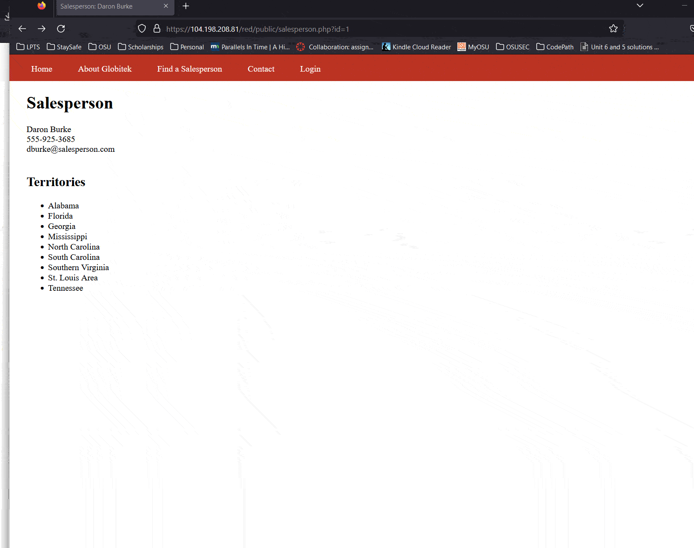

# Project8Codepath

# Pen Testing Live Targets

Time spent: **3** hours spent in total

> Objective: Identify vulnerabilities in three different versions of the Globitek website: blue, green, and red.

The six possible exploits are:

* Username Enumeration
* Insecure Direct Object Reference (IDOR)
* SQL Injection (SQLi)
* Cross-Site Scripting (XSS)
* Cross-Site Request Forgery (CSRF)
* Session Hijacking/Fixation

Each color is vulnerable to only 2 of the 6 possible exploits. First discover which color has the specific vulnerability, then write a short description of how to exploit it, and finally demonstrate it using screenshots compiled into a GIF.

## Blue

Vulnerability #1: SQL Injection

Description: When sending a query to the database the id parameter, the backend does not sanitize the query for SQL injections so one can pass in malicious code into the query for the salesperson database

## Green

Vulnerability #1: Cross-Site Scripting

Description: The contact form is vulnerable to XSS, so someone could post malicious code into the contact form and an admin could execute the script upon opening the page where contact requests are stored

## Red

Vulnerability #1: Indirect Object Reference Vulnerability

Description: When sending the query for a sales person's contact information, someone could manipulate the query and request the information of a saleperson whose profile is not publicly disclosed by the web developer/company

## Notes

The SQL injection gave me trouble, I had to add the other ' at the end of the injection
